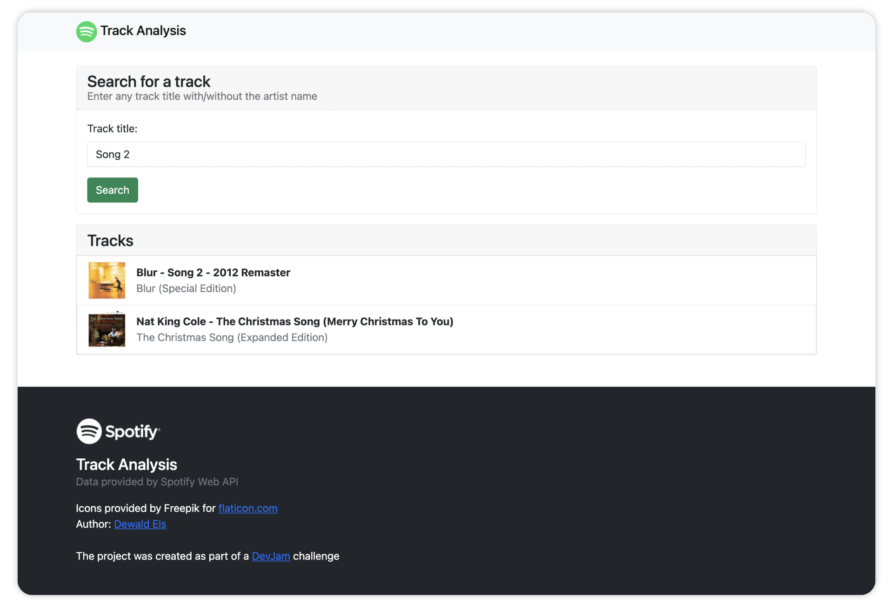

# DevJam - Spotify Track Analysis

Use the Track Analysis endpoint to give an overview of a song's key, temp and possible chord combinations. The API provides approximate data and might not always be 100% accurate.

### Live app
Demo Link: [https://devjam-dce-spotify-analysis.herokuapp.com/](https://devjam-dce-spotify-analysis.herokuapp.com/)

<figure>
    
</figure>

## Table of contents
- [DevJam - Spotify Track Analysis](#devjam---spotify-track-analysis)
    - [Live app](#live-app)
  - [Table of contents](#table-of-contents)
  - [Installation](#installation)
  - [Usage](#usage)
  - [Acknowledgements](#acknowledgements)
  - [Contributions](#contributions)
  - [License](#license)

## Installation
The project uses NodeJS with TypeScript for the backend and HTML + JavaScript for front-end.

Run the installation from the root of the directory:

```bash
npm install
```

## Usage

To run the project, run the start command from the root directory of the project. It will be served on http://localhost:3000 by default.

```bash
npm run dev
```

To build the project run the build command from the root of the directory.

```bash
npm run build
```
To test the built project run the start command.

```bash
npm start
```

## Acknowledgements
- [Bootstrap 5](https://getbootstrap.com)
- [Flaticon by Freepik](https://flaticon.com)
- [Spotify Web API](https://developer.spotify.com/)

## Contributions

Pull requests accepted.

## License
Unlicensed